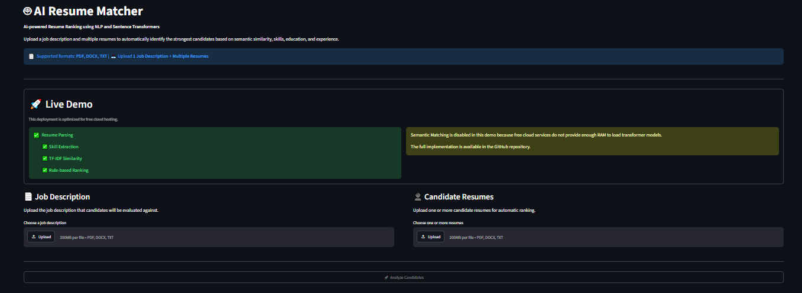
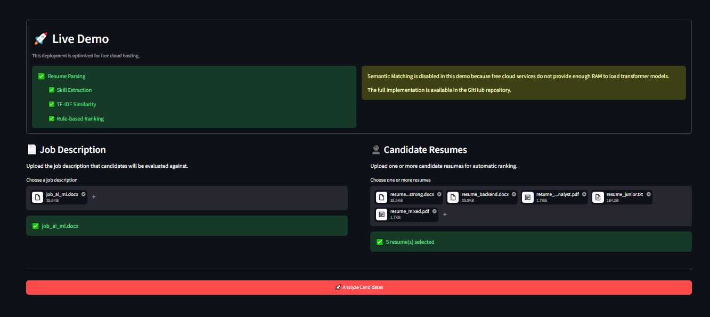
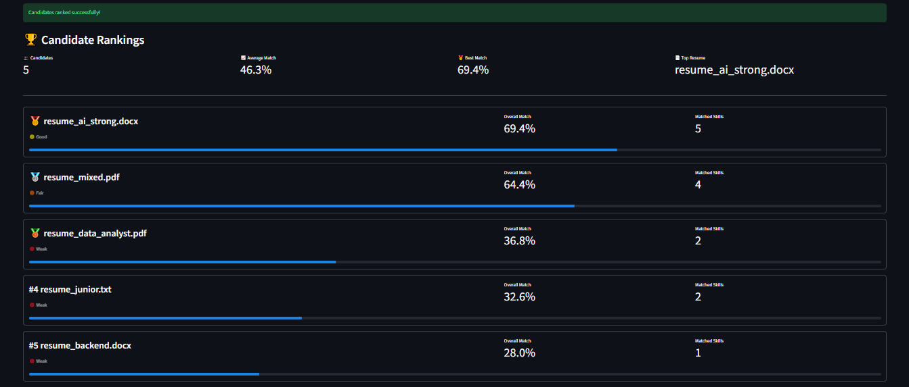
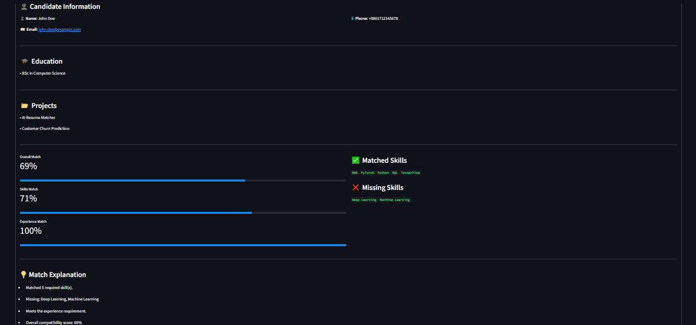
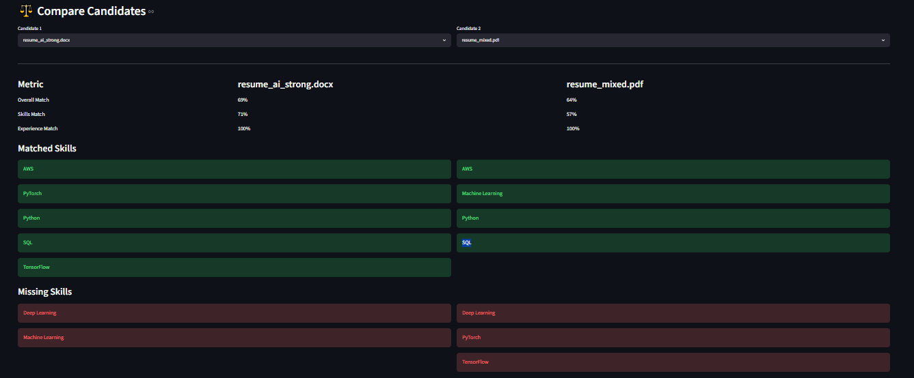
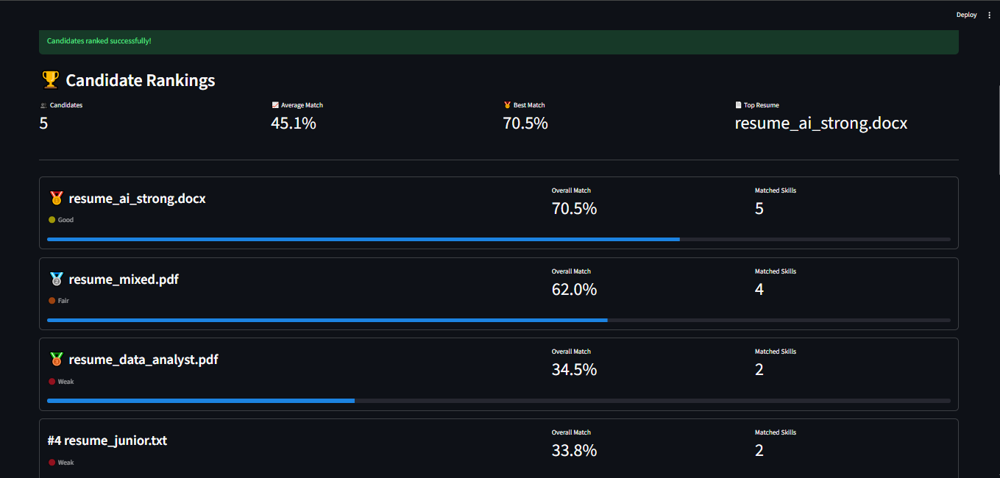
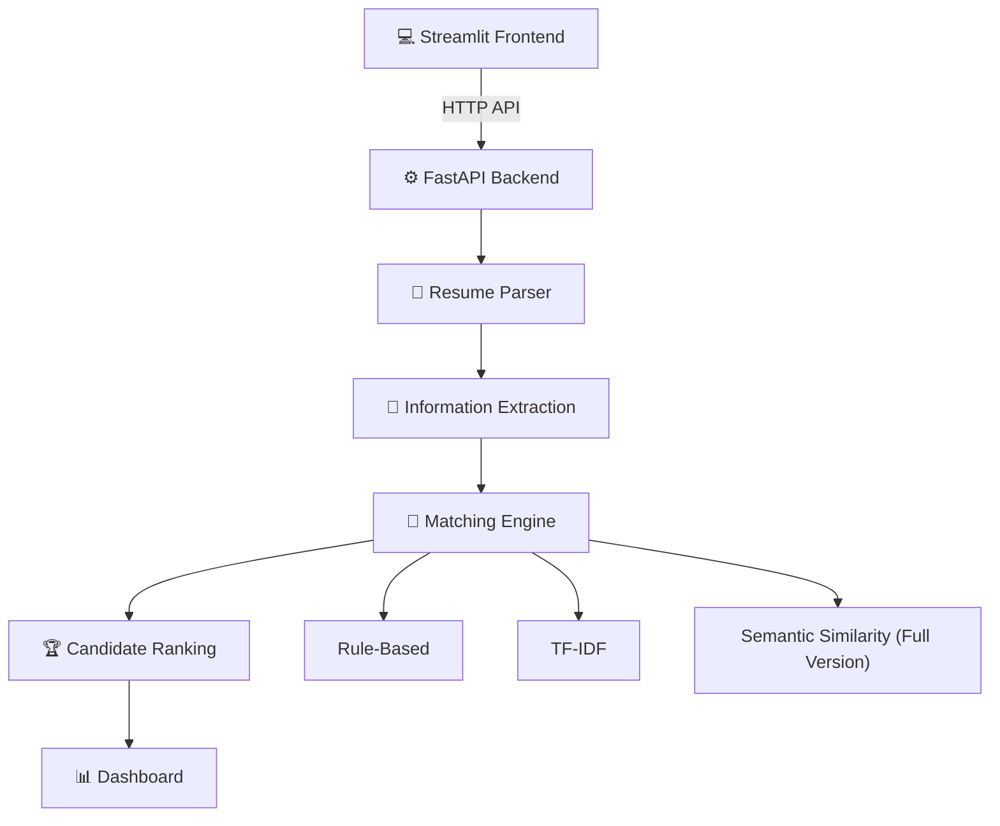
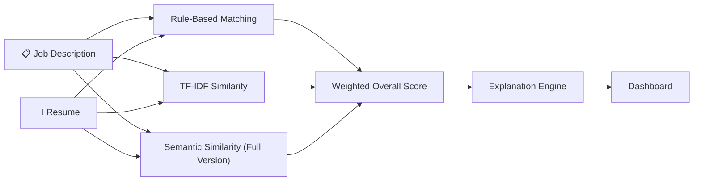

# 🤖 AI Resume Matcher


An AI-powered Applicant Tracking System (ATS) that automatically parses resumes, extracts candidate information, and ranks applicants against a job description using Natural Language Processing (NLP).

> Designed for recruiters and hiring teams to quickly identify the strongest candidates.
<p align="center">
  
</p>

---
# 🎯 Project Goals

This project was built to demonstrate the design and deployment of a modern AI-powered Applicant Tracking System using Natural Language Processing.

The focus was on creating a production-style application featuring:

- Modular software architecture
- RESTful API design
- Interactive web interface
- Docker-based deployment
- Explainable candidate ranking

---

## 🌐 Live Demo

**Live Demo:** https://resume-matcher-nlp.onrender.com

> **Note**
>
> The live demo uses Rule-Based Matching and TF-IDF Similarity to fit within the memory limits of free cloud hosting.
>
> The full version on the `main` branch additionally includes Semantic Similarity using Sentence Transformers.

---

# ✨ Features

- 📄 Resume Parsing
- 🧠 Job Description Parsing
- 🎯 Automatic Candidate Ranking
- ✅ Skill Matching
- 💼 Experience Matching
- 📊 Overall Match Score
- 📈 Candidate Comparison Dashboard
- 👤 Candidate Information Extraction
- 🎓 Education Extraction
- 📂 Project Extraction
- 💡 Match Explanation
- ⚡ FastAPI REST API
- 🎨 Interactive Streamlit Dashboard
- 🐳 Docker Support

---

# ⭐ Key Highlights

- AI-powered Applicant Tracking System (ATS)
- Supports PDF and DOCX resumes
- Automatic candidate ranking
- Multi-factor NLP matching
- Interactive recruiter dashboard
- REST API built with FastAPI
- Dockerized for easy deployment
- Live cloud deployment on Render

---

# 📸 Screenshots

## Upload Documents

<p align="center">
  
</p>

---

## Candidate Rankings

<p align="center">
  
</p>

---

## Candidate Details

<p align="center">
  
</p>

---

## Candidate Comparison

<p align="center">
  
</p>

---

## Full AI Version

The complete implementation available on the `main` branch includes transformer-based semantic similarity.

<p align="center">
  
</p>
---

# 🏗️ System Architecture



---

# 🧠 Matching Engine


> **Note**
>
> The live demo uses **Rule-Based Matching** and **TF-IDF Similarity**.
>
> The complete implementation on the `main` branch additionally includes **Sentence Transformer–based Semantic Similarity**.
---

# ⚙️ Tech Stack

## Programming Language

- Python 3.11

## Backend

- FastAPI
- Uvicorn

## Frontend

- Streamlit

## Machine Learning & NLP

- scikit-learn
- TF-IDF Vectorizer
- Sentence Transformers *(Full Version)*
- spaCy
- NLTK

## Document Processing

- PyMuPDF
- pdfplumber
- python-docx

## Data Processing

- NumPy
- Pandas

## Deployment & DevOps

- Docker
- Render

## Development Tools

- Git
- GitHub
- PyCharm

---

# 📊 Matching Algorithm

The overall candidate score is calculated using multiple NLP techniques.

### Rule-Based Matching

Compares:

- Skills
- Experience

### TF-IDF Similarity

Measures textual similarity between:

- Resume
- Job Description

### Semantic Similarity *(Full Version)*

Uses transformer embeddings to understand contextual similarity between resumes and job descriptions.

---

# 📂 Project Structure

```text
Resume-Matcher-NLP
│
├── frontend/
├── src/
│   ├── api/
│   ├── entity/
│   ├── matching/
│   ├── parser/
│   ├── similarity/
│   └── ...
│
├── tests/
├── Dockerfile
├── Dockerfile.render
├── requirements.txt
└── README.md
```

---

# 🛠️ Installation

## Prerequisites

- Python 3.11+
- Git
- Docker *(optional)*

## Clone Repository

```bash
git clone ...
```

## Install Dependencies

```bash
pip install -r requirements.txt
```

## Run Application

```bash
streamlit run frontend/app.py
```

---

# 🚀 Running with Docker

```bash
docker build -t resume-matcher .

docker run -p 8501:8501 resume-matcher
```

---

# 🔌 API Overview

| Method | Endpoint | Description |
|---------|----------|-------------|
| POST | `/match` | Analyze a single resume |
| POST | `/match/batch` | Analyze multiple resumes |
| GET | `/health` | Health check |

---

# 📈 Future Improvements

## AI Enhancements

- LLM-powered resume analysis
- RAG-based candidate search
- Skill ontology matching

## Platform Features

- User authentication
- Recruiter dashboard
- PostgreSQL integration
- Export reports

## Deployment

- AWS deployment
- Azure deployment
- CI/CD pipeline
- Kubernetes support

---

# 📚 Learning Outcomes

This project demonstrates practical experience with:

- NLP pipelines
- Machine learning similarity algorithms
- REST API development
- Docker containerization
- Cloud deployment
- Modular software architecture
- Interactive data visualization

---

# 📄 License

This project is licensed under the **MIT License**, which allows you to use, modify, and distribute the software with proper attribution.

See the [LICENSE](LICENSE) file for details.

---

# 👨‍💻 Author

## Faizur Rahman

Computer Science & Engineering graduate with a strong interest in **Artificial Intelligence**, **Machine Learning**, and **Software Engineering**.

### Connect with me

- **GitHub:** https://github.com/Faizur-Rahman99
- **LinkedIn:** www.linkedin.com/in/faizur-rahman99

---

## ⭐ Support

If you found this project helpful or interesting, please consider giving it a ⭐ on GitHub.

Your support helps showcase the project and motivates future improvements.

Thank you for visiting!
