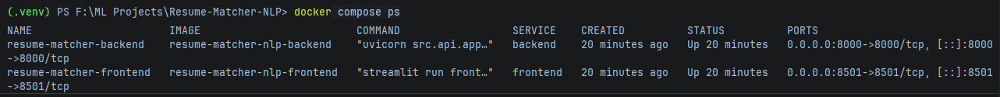
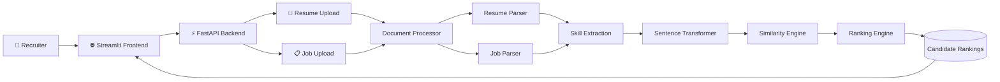
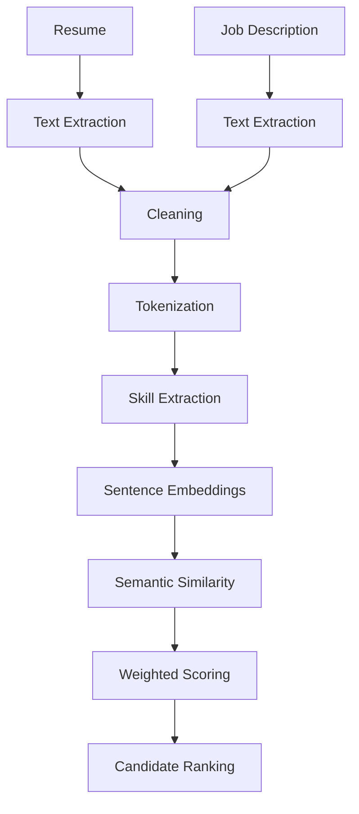
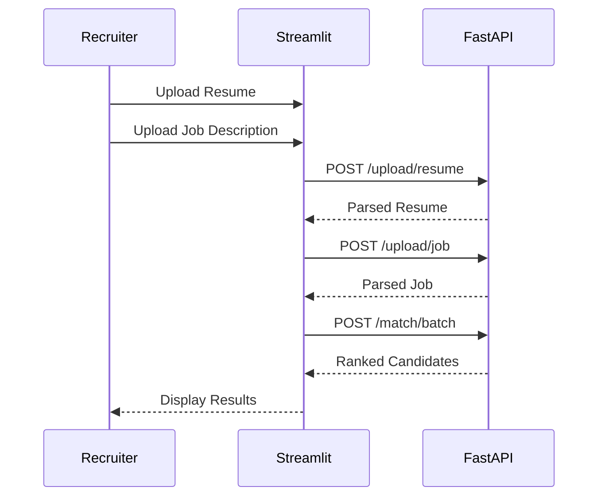

<div align="center">

# 🤖 Resume Matcher NLP

### AI-Powered Resume Ranking System using NLP, Sentence Transformers, FastAPI, Streamlit & Docker

<p align="center">


</p>

---

### Intelligent Resume Screening using Semantic Similarity & Natural Language Processing

Upload a job description and multiple resumes to automatically rank candidates based on semantic similarity, skills, experience, education, and NLP-powered analysis.

Designed as a production-style AI application with Dockerized deployment, FastAPI backend, and Streamlit frontend.

</div>

<p align="center">


</p>

<p align="center">


</p>

# 🚀 Live Demo

> Coming Soon

| Component | Status |
|-----------|--------|
| FastAPI Backend | ✅ |
| Streamlit Frontend | ✅ |
| Docker Support | ✅ |
| Batch Resume Ranking | ✅ |
| REST API | ✅ |

# 📸 Preview

## Dashboard


---

## Candidate Ranking


---

## Upload Interface


---

## Swagger API


---

## Docker Containers



# 📑 Table of Contents

- Overview
- Features
- Tech Stack
- Project Architecture
- AI Pipeline
- Folder Structure
- Installation
- Docker Deployment
- REST API
- Usage
- Screenshots
- Testing
- Future Improvements
- License
- Author

# 📖 Project Overview

Recruiters often receive hundreds of resumes for a single job posting, making manual screening slow, inconsistent, and time-consuming.

**Resume Matcher NLP** is an AI-powered application that automatically analyzes job descriptions and ranks candidate resumes using modern Natural Language Processing techniques.

Instead of relying solely on keyword matching, the application combines semantic similarity, skill extraction, education analysis, and experience evaluation to produce more meaningful candidate rankings.

The project follows a production-style architecture with a **FastAPI backend**, **Streamlit frontend**, and **Dockerized deployment**, making it easy to run locally or deploy to cloud environments.

---

# 🌟 Why This Project?

Unlike traditional Applicant Tracking Systems that rely primarily on keyword matching, Resume Matcher NLP combines semantic understanding with structured candidate evaluation.

Key advantages include:

- Semantic similarity instead of exact keyword matching
- Automatic skill extraction
- Education verification
- Experience scoring
- Recruiter-friendly UI
- REST API support
- Docker deployment
- Modular architecture for scalability

## 🎯 Objectives

- Automate resume screening
- Improve recruiter productivity
- Reduce manual bias
- Perform semantic matching instead of keyword matching
- Provide explainable candidate rankings
- Demonstrate production-ready AI engineering practices


# ✨ Features

## 🤖 AI Resume Ranking

- Semantic similarity using Sentence Transformers
- NLP-powered resume analysis
- Skill extraction
- Experience evaluation
- Education matching
- Weighted scoring algorithm

---

## 📄 Document Processing

Supports multiple file formats including

- PDF
- DOCX
- TXT

---

## 📊 Candidate Comparison

- Ranked candidate list
- Match percentage
- Skill comparison
- Missing skills detection
- Resume summaries

---

## ⚡ REST API

Built with FastAPI

Includes endpoints for

- Resume upload
- Job upload
- Resume matching
- Batch candidate ranking
- Health checks

---

## 🖥 Interactive Frontend

Built using Streamlit

- Upload resumes
- Upload job descriptions
- Compare candidates
- Interactive dashboard
- Clean recruiter-friendly interface

---

## 🐳 Docker Support

- Dockerized backend
- Dockerized frontend
- Docker Compose deployment
- Production-ready containerization

---

## 🧪 Testing

- Pytest
- API testing
- Health endpoint validation
- Modular architecture

# 🛠 Tech Stack

| Category | Technologies |
|-----------|--------------|
| Programming Language | Python 3.11 |
| Backend | FastAPI |
| Frontend | Streamlit |
| NLP | spaCy, NLTK |
| Embeddings | Sentence Transformers |
| Machine Learning | Scikit-learn |
| Deep Learning | PyTorch |
| Data Processing | Pandas, NumPy |
| API Server | Uvicorn |
| Containerization | Docker |
| Testing | Pytest |
| Version Control | Git & GitHub |

# 🏗️ System Architecture



# 🧠 AI/NLP Pipeline



# 🔄 Request Flow



# 📂 Project Structure

```text
Resume-Matcher-NLP/

│
├── frontend/
│   ├── components/
│   ├── config/
│   ├── services/
│   └── app.py
│
├── src/
│   ├── api/
│   ├── components/
│   ├── configuration/
│   ├── entity/
│   ├── io/
│   ├── models/
│   ├── nlp/
│   ├── pipelines/
│   ├── services/
│   ├── utils/
│   └── ...
│
├── data/
│   └── raw/
│
├── tests/
│
├── docs/
│
├── screenshots/
│
├── assets/
│
├── Dockerfile.backend
├── Dockerfile.frontend
├── docker-compose.yml
├── requirements.txt
├── README.md
└── LICENSE
```

# 🧩 Core Components

| Component | Responsibility |
|------------|----------------|
| Streamlit | User Interface |
| FastAPI | REST API |
| Document Processor | Reads uploaded files |
| Resume Parser | Extracts structured information |
| Job Parser | Parses job descriptions |
| Skill Extractor | Detects technical skills |
| Sentence Transformer | Creates semantic embeddings |
| Matching Engine | Computes similarity |
| Ranking Engine | Generates candidate rankings |
| Docker | Containerized deployment |

# 🏛️ Design Principles

The application follows modern software engineering principles.

- Modular Architecture
- Separation of Concerns
- Object-Oriented Design
- Dependency Injection
- Service Layer Pattern
- Repository Pattern
- API-first Development
- Dockerized Deployment
- Production-ready Project Structure

# ⚙️ Installation

## Clone the Repository

```bash
git clone https://github.com/Faizur-Rahman99/Resume-Matcher-NLP.git

cd Resume-Matcher-NLP
```

---

## Create a Virtual Environment

### Windows

```bash
python -m venv .venv

.venv\Scripts\activate
```

### Linux / macOS

```bash
python3 -m venv .venv

source .venv/bin/activate
```

---

## Install Dependencies

```bash
pip install -r requirements.txt
```

---

## Download NLP Resources

The application automatically downloads required NLTK datasets during the first run.

Required datasets include:

- punkt
- punkt_tab
- stopwords

---

## Run the Backend

```bash
uvicorn src.api.app:app --reload
```

Backend URL

```
http://localhost:8000
```

Swagger Documentation

```
http://localhost:8000/docs
```

---

## Run the Frontend

```bash
streamlit run frontend/app.py
```

Frontend URL

```
http://localhost:8501
```

# 🐳 Docker Deployment

The entire application can be started using Docker Compose.

## Build Containers

```bash
docker compose build
```

---

## Start Containers

```bash
docker compose up
```

---

## Start in Background

```bash
docker compose up -d
```

---

## Stop Containers

```bash
docker compose down
```

---

## View Logs

```bash
docker compose logs

docker compose logs backend

docker compose logs frontend
```

---

## Rebuild

```bash
docker compose up --build
```

---

## Running Containers

| Container | Port |
|------------|------|
| Backend | 8000 |
| Frontend | 8501 |


# 📡 REST API

The backend exposes a REST API built using FastAPI.

## Health Check

```
GET /health
```

---

## Upload Resume

```
POST /upload/resume
```

Accepts

- PDF
- DOCX
- TXT

---

## Upload Job Description

```
POST /upload/job
```

Accepts

- PDF
- DOCX
- TXT

---

## Match Candidate

```
POST /match
```

Returns

- Match Score
- Missing Skills
- Experience Match
- Education Match

---

## Batch Candidate Ranking

```
POST /match/batch
```

Returns

- Ranked Candidates
- Similarity Scores
- Detailed Comparison

# 📄 Example Response

```json
{
  "candidate": "resume_ai.pdf",
  "score": 94.6,
  "matched_skills": [
    "Python",
    "Machine Learning",
    "Docker",
    "FastAPI",
    "PyTorch"
  ],
  "missing_skills": [
    "Kubernetes"
  ]
}
```

# 🚀 Example Workflow

1. Upload a Job Description.

2. Upload one or more candidate resumes.

3. Resume Matcher extracts

- Skills
- Education
- Experience
- Resume Text

4. Sentence Transformers generate semantic embeddings.

5. Similarity scores are calculated.

6. Additional weighted scoring is applied.

7. Candidates are ranked from best to worst.

8. Results are displayed in the Streamlit dashboard.

# 🧪 Testing

Run all tests

```bash
pytest
```

Run with coverage

```bash
pytest --cov=src
```

Current testing includes

- API endpoints
- Resume parsing
- Job parsing
- Skill extraction
- Similarity engine
- Candidate ranking

# 🔐 Environment Variables

Example

```env
API_URL=http://backend:8000
```

Additional variables can be configured depending on deployment requirements.


# 📸 Application Screenshots

| Dashboard | Candidate Ranking |
|------------|-------------------|
|  |  |

| Resume Upload | Swagger API |
|---------------|-------------|
|  |  |


